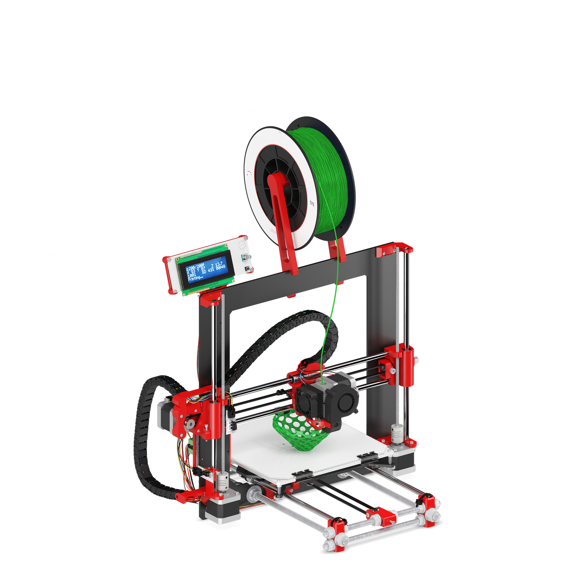

Hephestos
======

In this repository you will find the source files for the [BQ Hephestos 3D printer](https://www.bq.com/en/hephestos-prusa).  

The Hephestos is a revision of the Prusa i3 Hephestos printer. This printer includes all the advantages of its predecessor plus a few extra improvements aimed at better print quality and an enhanced user experience with regard to assembly.

The first change concerns its packaging. The user can easily identify the components to be assembled as they have reference numbers and are arranged in two trays.

Some printed parts have been modified such as the new filament support, which adapts better to the spool avoiding vibration

The electronics have been replaced by a BQ-designed ZUM Mega 3D board which incorporates a 32 microstep driver for improved motor control. It also provides better heat dissipation and comes with a microUSB port.

The addition of knurled knobs affords the user maximum accuracy when levelling the bed. 

The integration of toothed pulleys with bearings into the X and Y axes provides these with better movement in terms of definition and quality. 
The assembly guide has been totally redesigned. It uses line drawings and exploded-view diagrams which offer the user a clear, simple view of the assembly process.

# License 

Hephestos is licensed under a [Creative Commons Attribution-ShareAlike 4.0 International License](http://creativecommons.org/licenses/by-sa/4.0/)

Please read the LICENSE file for more details.

# Credits

 * Hephestos is based on Prusa i3 Hephestos. Credit to the reprap community and specially to Josef Prusa.
 * Electronics are designed from scratch by BQ hardware team and the base of knowledge from reprap community.

#Firmware
Firmware: [https://github.com/bq/Marlin](https://github.com/bq/Marlin)

Directory structure
===================

 * `Mechanical Design`: Hephestos exported stl files.

 * `Electronic Design`: Hephestos Electronics BOM, Schematics and PCB files.

 * `Hephestos-LOM.ods`: Hephestos List of Materials. Document for [LibreOffice](https://www.libreoffice.org/).
 
Contact
===================

__Community forum:__  [Mibqyyo](http://www.mibqyyo.com/comunidad/?lang=en)

__Email support:__ support3d@bq.com

